<div align="center">

# 🛡️ Elara Platform

### Enterprise-Grade Cybersecurity & Threat Intelligence Platform

[](https://opensource.org/licenses/MIT)
[](https://cloud.google.com)
[](https://kubernetes.io)
[](https://www.typescriptlang.org/)
[](https://nodejs.org/)
[](https://reactjs.org/)
[](https://www.postgresql.org/)
[](https://redis.io/)

**Production-Ready** | **Cloud-Native** | **AI-Powered** | **Real-Time Protection**

[Features](#-key-features) •
[Architecture](#-architecture) •
[Quick Start](#-quick-start) •
[Documentation](#-documentation) •
[Deployment](#-deployment)

</div>

---

## 📖 Table of Contents

- [Overview](#-overview)
- [Key Features](#-key-features)
- [Architecture](#-architecture)
  - [High-Level Architecture](#high-level-architecture-diagram)
  - [Technology Stack](#-technology-stack)
  - [Infrastructure](#-infrastructure)
- [Quick Start](#-quick-start)
- [Documentation](#-documentation)
- [Deployment](#-deployment)
- [Security](#-security)
- [Cost Analysis](#-cost-analysis)
- [Monitoring](#-monitoring--observability)
- [Contributing](#-contributing)
- [License](#-license)

---

## 🌟 Overview

**Elara** is a comprehensive, enterprise-grade cybersecurity platform that provides real-time threat intelligence, automated security scanning, and AI-powered threat analysis. Built with modern cloud-native architecture and deployed on Google Cloud Platform, Elara protects organizations from phishing, malware, and advanced cyber threats.

### 🎯 Core Capabilities

<table>
<tr>
<td width="50%">

**🔍 Threat Detection**
- Real-time URL scanning
- Phishing detection (13 categories)
- Malware analysis
- Social engineering detection
- Brand impersonation detection

</td>
<td width="50%">

**🤖 AI-Powered Analysis**
- Multi-LLM consensus engine
- Claude Sonnet 4.5 integration
- GPT-4 Turbo analysis
- Google Gemini processing
- RAG-enhanced intelligence

</td>
</tr>
<tr>
<td width="50%">

**📊 Threat Intelligence**
- 18+ threat intel sources
- 200K+ threat indicators
- Real-time feed synchronization
- AbuseIPDB, URLhaus, ThreatFox
- AlienVault OTX, URLScan.io

</td>
<td width="50%">

**🌐 Multi-Channel Access**
- Web application (React)
- Browser extension (Chrome/Firefox)
- WhatsApp integration
- REST API
- Admin control panel

</td>
</tr>
</table>

---

## 🚀 Key Features

### Enterprise Security Suite


### 📊 Comprehensive Scanning Capabilities

| Category | Description | Coverage |
|----------|-------------|----------|
| 🌐 **Domain Analysis** | WHOIS data, age verification, DNS analysis | 40 points |
| 🔒 **SSL/TLS Security** | Certificate validation, HSTS, cipher strength | 45 points |
| 🛡️ **Threat Intelligence** | 18+ sources, real-time threat feeds | 50 points |
| 📝 **Content Analysis** | HTML parsing, JavaScript analysis, hidden elements | 40 points |
| 🎣 **Phishing Detection** | Brand impersonation, typosquatting | 50 points |
| 🦠 **Malware Detection** | Drive-by downloads, exploit kits | 45 points |
| 🔄 **Behavioral Analysis** | Redirect chains, URL patterns | 25 points |
| 🎭 **Social Engineering** | Urgency tactics, authority abuse | 30 points |
| 💰 **Financial Fraud** | Payment scams, crypto fraud | 25 points |
| 🔑 **Identity Theft** | PII harvesting detection | 20 points |
| ⚡ **Technical Exploits** | SQL injection, XSS, CSRF | 15 points |
| 🏢 **Brand Protection** | Logo theft, trademark violations | 20 points |
| 🌍 **Network Analysis** | IP reputation, ASN scoring | 15 points |

**Total Risk Score**: 0-350 points across 13 security categories

---

## 🏗️ Architecture

### High-Level Architecture Diagram


### System Architecture Flow


### 💻 Technology Stack

<table>
<tr>
<th width="33%">Backend</th>
<th width="33%">Frontend</th>
<th width="34%">Infrastructure</th>
</tr>
<tr>
<td valign="top">

**Runtime & Framework**
- Node.js 20.x
- Express.js 4.18
- TypeScript 5.0

**Database & Caching**
- Prisma ORM 5.22
- PostgreSQL 15
- Redis 7.0

**Authentication & Security**
- JWT + Refresh Tokens
- bcrypt (12 rounds)
- Helmet.js
- Rate Limiting

**AI Integration**
- Anthropic SDK
- OpenAI SDK
- Google AI SDK

</td>
<td valign="top">

**Framework**
- React 18
- TypeScript 5.0
- Vite 5.0

**UI & Styling**
- Tailwind CSS 3.4
- Material-UI (MUI)
- Lucide Icons
- Recharts

**State & Routing**
- React Context
- React Router v6
- Axios

**Build & Dev**
- Vite HMR
- ESLint + Prettier
- TypeScript Strict Mode

</td>
<td valign="top">

**Cloud Platform**
- Google Cloud Platform
- GKE Autopilot
- Cloud SQL
- Cloud Memorystore

**CI/CD**
- GitHub Actions
- Cloud Build
- Container Registry

**Infrastructure as Code**
- Terraform
- Kubernetes Manifests
- Kustomize Overlays

**Monitoring**
- Cloud Monitoring
- Cloud Logging
- Uptime Checks
- Custom Dashboards

</td>
</tr>
</table>

### 🌐 Infrastructure


---

## ⚡ Quick Start

### Prerequisites

Ensure you have the following installed:

- **Node.js** >= 20.x ([Download](https://nodejs.org/))
- **pnpm** >= 8.x (`npm install -g pnpm`)
- **Docker** ([Download](https://www.docker.com/))
- **Git** ([Download](https://git-scm.com/))

### Local Development Setup

```bash
# 1. Clone the repository
git clone https://github.com/Elara-Tanmoy/elara-mvp-final.git
cd elara-mvp-final

# 2. Install dependencies
pnpm install

# 3. Configure environment variables
cp packages/backend/.env.example packages/backend/.env
cp packages/frontend/.env.example packages/frontend/.env

# Edit .env files with your API keys and configuration

# 4. Start local infrastructure (PostgreSQL, Redis)
docker-compose up -d

# 5. Run database migrations
cd packages/backend
pnpm db:generate
pnpm db:migrate
pnpm db:seed

# 6. Start development servers
cd ../..
pnpm dev
```

**Access the application:**
- 🌐 Frontend: http://localhost:5173
- 🔧 Backend API: http://localhost:5000
- 📊 API Docs: http://localhost:5000/api-docs

### Development Commands

```bash
# Start all services
pnpm dev

# Start individual services
pnpm dev:backend          # Backend API only
pnpm dev:frontend         # Frontend only
pnpm dev:proxy            # Proxy service only

# Database operations
pnpm db:generate          # Generate Prisma client
pnpm db:migrate          # Run migrations
pnpm db:seed             # Seed database
pnpm db:studio           # Open Prisma Studio

# Code quality
pnpm lint                # Lint all packages
pnpm format              # Format code with Prettier
pnpm type-check          # TypeScript type checking
pnpm test                # Run all tests

# Build for production
pnpm build               # Build all packages
```

---

## 📚 Documentation

### 📖 Essential Reading

<table>
<tr>
<td width="50%">

**🏗️ Architecture & Design**
- [System Architecture](docs/architecture/system-architecture.md)
- [High-Level Design (HLD)](docs/architecture/high-level-design.md)
- [Low-Level Design (LLD)](docs/architecture/low-level-design.md)
- [Solution Architecture (SAD)](docs/architecture/solution-architecture.md)
- [Data Flow Diagrams](docs/architecture/data-flow-diagrams.md)
- [Prisma ORM Architecture](docs/architecture/prisma-orm-architecture.md)

</td>
<td width="50%">

**🚀 Deployment & Operations**
- [GCP Deployment Blueprint](docs/architecture/gcp-deployment-blueprint.md)
- [CI/CD Pipeline Guide](docs/deployment/CI_CD_GUIDE.md)
- [Secrets Management](docs/SECRETS_MANAGEMENT.md)
- [Infrastructure Setup](docs/deployment/infrastructure-setup.md)
- [Kubernetes Guide](docs/deployment/kubernetes-guide.md)
- [Disaster Recovery](docs/deployment/disaster-recovery.md)

</td>
</tr>
<tr>
<td width="50%">

**💻 Development**
- [Local Development Guide](docs/development/local-development.md)
- [API Documentation](docs/api/complete-api-reference.md)
- [Database Schema](docs/architecture/database/prisma-schema-complete.md)
- [Contributing Guide](CONTRIBUTING.md)
- [Code Style Guide](docs/development/code-style.md)

</td>
<td width="50%">

**🔧 Operations & Maintenance**
- [Troubleshooting Guide](docs/deployment/troubleshooting.md)
- [Monitoring & Alerting](docs/operations/monitoring.md)
- [Backup & Restore](docs/deployment/backup-strategy.md)
- [Cost Optimization](docs/infrastructure/cost-optimization.md)
- [Security Best Practices](docs/security/best-practices.md)

</td>
</tr>
</table>

### 📊 Complete Documentation Index

For a complete list of all documentation, see [Documentation Index](docs/DOCUMENTATION_INDEX.md)

---

## 🚢 Deployment

### Deployment Workflow

```mermaid
graph LR
    A[Local Development] --> B[Git Commit]
    B --> C{Branch?}
    C -->|develop| D[Dev Deploy]
    C -->|staging| E[Staging Deploy]
    C -->|main| F[Prod Deploy]

    D --> G[GitHub Actions]
    E --> G
    F --> G

    G --> H[Cloud Build]
    H --> I[Build Container]
    I --> J[Push to GCR]
    J --> K[Deploy to GKE]
    K --> L[Health Checks]
    L --> M{Healthy?}
    M -->|Yes| N[✅ Deployment Success]
    M -->|No| O[❌ Rollback]
    O --> P[Alert DevOps]

    style A fill:#61DAFB,stroke:#333,stroke-width:2px
    style N fill:#28a745,stroke:#333,stroke-width:2px,color:#fff
    style O fill:#dc3545,stroke:#333,stroke-width:2px,color:#fff
```



### Environment URLs

| Environment | Frontend | Backend | Namespace | Branch |
|-------------|----------|---------|-----------|--------|
| **Development** | http://136.117.33.149 | http://35.199.176.26/api | `elara-*-dev` | `develop` |
| **Staging** | _(Not Deployed)_ | _(Not Deployed)_ | `elara-*-staging` | `staging` |
| **Production** | http://34.36.48.252 | http://34.36.48.252/api | `elara-*` | `main` |

### Quick Deployment

```bash
# Deploy to Development
git checkout develop
git add .
git commit -m "feat: new feature"
git push origin develop
# ✅ Auto-deploys to dev environment

# Deploy to Production
git checkout main
git merge develop
git push origin main
# ✅ Auto-deploys to production

# Monitor deployment
kubectl rollout status deployment/elara-api -n elara-backend

# View logs
kubectl logs -f deployment/elara-api -n elara-backend

# Scale deployment
kubectl scale deployment elara-api --replicas=5 -n elara-backend
```

### Infrastructure Setup

See [GCP Deployment Blueprint](docs/architecture/gcp-deployment-blueprint.md) for complete infrastructure setup guide using Terraform.

---

## 🔒 Security

### Security Features


### Security Measures

- ✅ **Authentication**: JWT tokens with 30-min access + 7-day refresh tokens
- ✅ **Password Security**: bcrypt hashing with 12 rounds
- ✅ **API Security**: Rate limiting per user tier (Free: 100/hr, Pro: 1000/hr, Enterprise: 10000/hr)
- ✅ **Database Security**: Prisma ORM with parameterized queries (SQL injection protection)
- ✅ **Network Security**: Private VPC, firewall rules, HTTPS-only
- ✅ **Secret Management**: GCP Secret Manager with Workload Identity
- ✅ **Input Validation**: Zod schema validation on all endpoints
- ✅ **Security Headers**: Helmet.js (XSS, CSRF, clickjacking protection)
- ✅ **Audit Logging**: Complete audit trail of all security events
- ✅ **Encryption**: TLS 1.3 in transit, AES-256 at rest

See [Secrets Management Guide](docs/SECRETS_MANAGEMENT.md) for secure credential handling.

---

## 💰 Cost Analysis

### Current Monthly Infrastructure Cost

**Total: ~$450-600/month** (Cost-optimized for production)


| Resource | Configuration | Monthly Cost | Notes |
|----------|--------------|--------------|-------|
| **GKE Autopilot** | 5 nodes, auto-scaling | $200-250 | Optimized for workload |
| **Cloud SQL** | db-custom-2-7680 (2 vCPU, 7.5GB RAM, 100GB SSD) | $150 | Zonal, cost-optimized |
| **Cloud Memorystore Redis** | 5GB, STANDARD_HA | $60 | High availability enabled |
| **Load Balancer** | Global + Regional | $40 | HTTPS + SSL |
| **Cloud Build** | CI/CD automation | $20-30 | Build minutes included |
| **Container Registry** | Docker image storage | $10 | Minimal storage |
| **Cloud Monitoring** | Logs + Metrics | $20 | Standard tier |
| **Network Egress** | Data transfer | $20-30 | Moderate usage |

### Cost Optimization Features

- ✅ Autopilot GKE (pay only for pods, not nodes)
- ✅ Zonal Cloud SQL (no multi-region cost)
- ✅ Redis caching reduces database queries
- ✅ CDN for static assets
- ✅ Auto-scaling based on load
- ✅ Preemptible VMs for batch jobs (planned)

See [Cost Optimization Guide](docs/infrastructure/cost-optimization.md) for detailed analysis and optimization strategies.

---

## 📊 Monitoring & Observability

### Monitoring Stack


### Key Metrics Monitored

- **Application Performance**: Request latency, throughput, error rates
- **Infrastructure Health**: CPU, memory, disk usage
- **Database Performance**: Query performance, connection pool
- **Redis Performance**: Cache hit rate, memory usage
- **API Metrics**: Endpoint response times, status codes
- **Security Events**: Failed auth attempts, rate limit violations

### Health Check Endpoints

- `GET /api/health` - Overall system health
- `GET /api/health/db` - Database connectivity
- `GET /api/health/redis` - Redis connectivity
- `GET /api/health/ai` - AI services status

---

## 🤝 Contributing

We welcome contributions from the community! Please read our [Contributing Guide](CONTRIBUTING.md) for details on:

- Code of conduct
- Development workflow
- Commit message conventions
- Pull request process
- Coding standards

### Development Workflow

```bash
# 1. Fork the repository
# 2. Create a feature branch
git checkout -b feature/amazing-feature

# 3. Make your changes
# 4. Run tests
pnpm test

# 5. Commit your changes (following conventional commits)
git commit -m "feat: add amazing feature"

# 6. Push to your fork
git push origin feature/amazing-feature

# 7. Open a Pull Request
```

---

## 📄 License

This project is licensed under the **MIT License** - see the [LICENSE](LICENSE) file for details.

---

## 🙏 Acknowledgments

- [Anthropic](https://www.anthropic.com/) - Claude AI integration
- [OpenAI](https://openai.com/) - GPT-4 analysis capabilities
- [Google Cloud](https://cloud.google.com/) - Infrastructure platform
- [Prisma](https://www.prisma.io/) - Database ORM
- [React](https://reactjs.org/) - Frontend framework

---

<div align="center">

### 📬 Contact & Support

**Email**: support@elara-platform.com
**Documentation**: [docs/](docs/)
**Issues**: [GitHub Issues](https://github.com/Elara-Tanmoy/elara-mvp-final/issues)

---

**Version**: 1.0.0 | **Last Updated**: 2025-10-24 | **Status**: ✅ Production Ready

**Built with ❤️ by the Elara Security Team**

[⬆ Back to Top](#-elara-platform)

</div>
