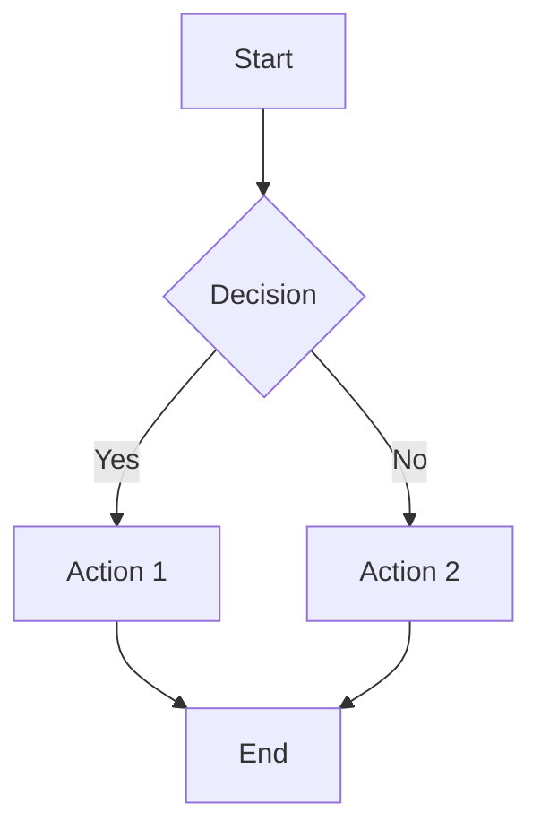
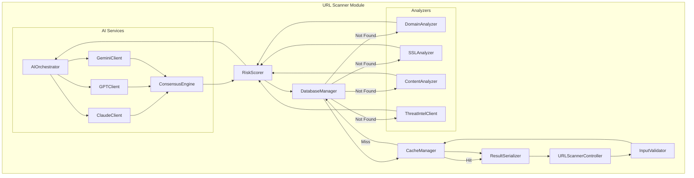
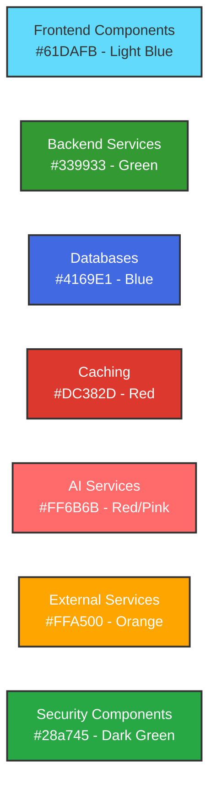
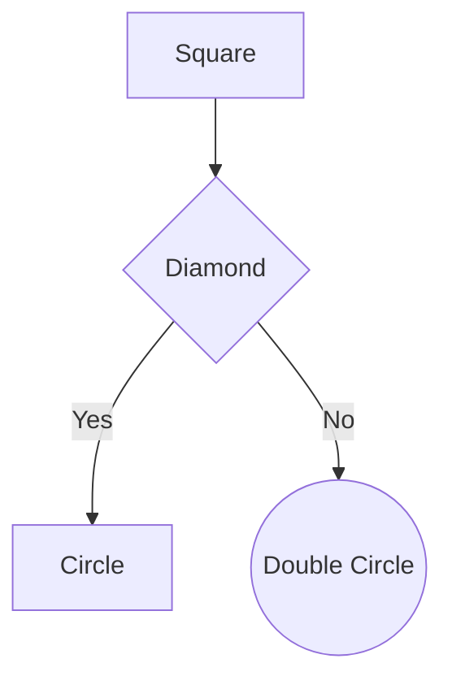
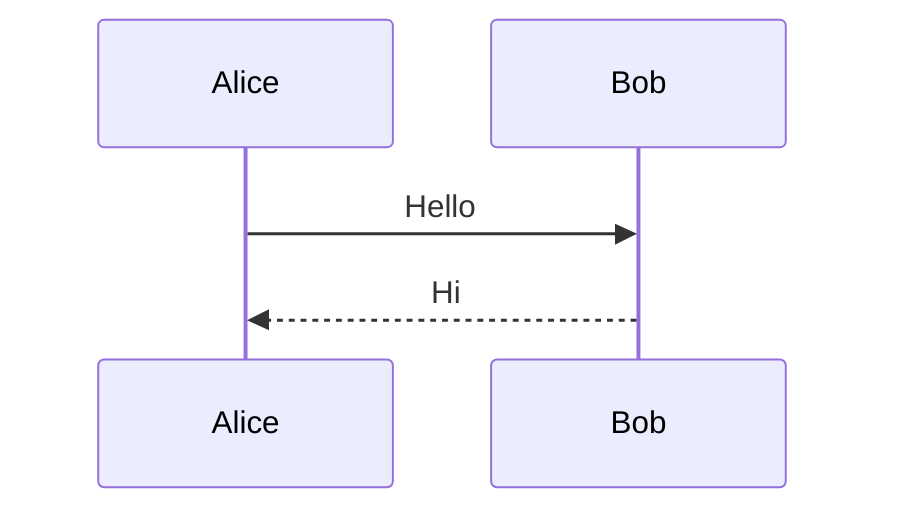
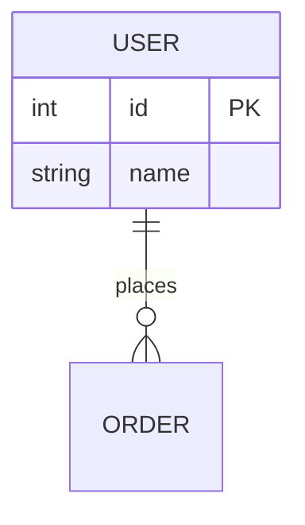
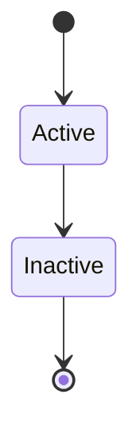

# Architecture Diagram Generation Guide

**Purpose**: Complete guide to generating professional enterprise-grade architecture diagrams for Elara Platform
**Tools**: Mermaid (GitHub native), eraser.io AI, PlantUML, Draw.io
**Last Updated**: 2025-10-24

---

## Table of Contents

1. [Overview](#1-overview)
2. [Using Mermaid (GitHub Native)](#2-using-mermaid-github-native)
3. [Using Eraser.io AI](#3-using-eraserio-ai)
4. [Diagram Types Checklist](#4-diagram-types-checklist)
5. [Diagram Generation Prompts](#5-diagram-generation-prompts)
6. [Best Practices](#6-best-practices)

---

## 1. Overview

### 1.1 Current Status

✅ **Completed Diagrams** (Mermaid format, embedded in documentation):
- High-Level Architecture Diagram
- System Context Diagram
- Logical Architecture
- Component Overview
- High-Level Design (HLD)
- Data Flow Diagrams (Level 0, 1, 2)
- Use Case Diagrams
- Sequence Diagrams (URL Scan, Auth, Threat Intel Sync, AI Consensus)
- State Diagrams (Scan Result, User Session)
- Component Interaction Diagrams
- Deployment Architecture
- Security Architecture
- Monitoring Stack
- Cost Breakdown (Pie Chart)

🔄 **Remaining Diagrams** (To be generated):
- Low-Level Design (LLD) - Component internals
- Solution Architecture Diagram (SAD) - Complete solution view
- Network Architecture Diagram
- Database Schema Diagram (detailed ERD)
- CI/CD Pipeline Diagram (detailed)
- Disaster Recovery Architecture
- Multi-Region Deployment (future)
- Container Architecture
- API Architecture Diagram

---

## 2. Using Mermaid (GitHub Native)

### 2.1 Why Mermaid?

✅ **Advantages**:
- Renders natively on GitHub (no external tools needed)
- Version controlled (text-based)
- Easy to update and maintain
- Supports 15+ diagram types
- Free and open-source

### 2.2 Mermaid Diagram Types

| Diagram Type | Mermaid Syntax | Use Case |
|-------------|----------------|----------|
| **Flowchart** | `graph TB` | Process flows, architecture |
| **Sequence** | `sequenceDiagram` | API interactions, flows |
| **Class** | `classDiagram` | Object-oriented design |
| **State** | `stateDiagram-v2` | State machines |
| **ER Diagram** | `erDiagram` | Database schema |
| **Gantt** | `gantt` | Project timeline |
| **Pie Chart** | `pie` | Cost breakdown, metrics |
| **Git Graph** | `gitGraph` | Branch strategy |
| **Mindmap** | `mindmap` | Feature breakdown |
| **Timeline** | `timeline` | Deployment history |

### 2.3 How to Add Mermaid Diagrams

````markdown

````

### 2.4 Mermaid Live Editor

Use for testing diagrams before adding to docs:
- **URL**: https://mermaid.live
- Provides real-time preview
- Can export to PNG/SVG
- Share diagrams via URL

---

## 3. Using Eraser.io AI

### 3.1 About Eraser.io

**Eraser.io** is an AI-powered diagramming tool specifically designed for software architecture diagrams.

- **URL**: https://www.eraser.io
- **Features**: AI diagram generation, collaborative editing, export to PNG/SVG
- **Free Tier**: Limited diagrams per month
- **Pro**: Unlimited diagrams, team collaboration

### 3.2 How to Use Eraser.io AI

#### Step 1: Create Account
1. Go to https://www.eraser.io
2. Sign up with email or GitHub
3. Create a new workspace

#### Step 2: Generate Diagram with AI

1. Click **"New Diagram"**
2. Select **"Generate with AI"**
3. Paste an architecture prompt (see Section 5)
4. Click **"Generate"**
5. Review and refine the diagram
6. Export as PNG or SVG

#### Step 3: Export and Add to Documentation

```bash
# Download diagram as PNG
# Save to: docs/architecture/diagrams/

# Add to markdown:

```

### 3.3 Eraser.io Diagram Types

- **Architecture Diagrams**: Cloud architecture, microservices
- **Sequence Diagrams**: API flows, user journeys
- **Entity-Relationship Diagrams**: Database schema
- **Flowcharts**: Business logic, decision trees
- **Component Diagrams**: System components
- **Network Diagrams**: Infrastructure, networking

---

## 4. Diagram Types Checklist

### 4.1 Architecture Diagrams

| Diagram Type | Status | Tool | Location |
|-------------|--------|------|----------|
| **High-Level Design (HLD)** | ✅ Complete | Mermaid | `docs/architecture/high-level-design.md` |
| **Low-Level Design (LLD)** | 🔄 To Create | Mermaid/Eraser.io | `docs/architecture/low-level-design.md` |
| **Solution Architecture (SAD)** | 🔄 To Create | Eraser.io | `docs/architecture/solution-architecture.md` |
| **System Context** | ✅ Complete | Mermaid | `README.md`, `high-level-design.md` |
| **Component Diagram** | ✅ Complete | Mermaid | `high-level-design.md` |
| **Deployment Diagram** | ✅ Complete | Mermaid | `README.md`, `high-level-design.md` |
| **Network Architecture** | 🔄 To Create | Eraser.io | `docs/architecture/network-architecture.md` |

### 4.2 Data Flow Diagrams

| Diagram | Status | Tool | Location |
|---------|--------|------|----------|
| **Level 0 DFD (Context)** | ✅ Complete | Mermaid | `use-case-and-data-flow-diagrams.md` |
| **Level 1 DFD** | ✅ Complete | Mermaid | `use-case-and-data-flow-diagrams.md` |
| **Level 2 DFD (Scan)** | ✅ Complete | Mermaid | `use-case-and-data-flow-diagrams.md` |
| **Level 2 DFD (Auth)** | 🔄 To Create | Mermaid | `use-case-and-data-flow-diagrams.md` |
| **Level 2 DFD (Admin)** | 🔄 To Create | Mermaid | `use-case-and-data-flow-diagrams.md` |

### 4.3 UML Diagrams

| Diagram | Status | Tool | Location |
|---------|--------|------|----------|
| **Use Case Diagram** | ✅ Complete | Mermaid | `use-case-and-data-flow-diagrams.md` |
| **Sequence Diagrams** | ✅ Complete | Mermaid | `use-case-and-data-flow-diagrams.md`, `high-level-design.md` |
| **State Diagrams** | ✅ Complete | Mermaid | `use-case-and-data-flow-diagrams.md` |
| **Class Diagram** | 🔄 To Create | Mermaid | `docs/architecture/class-diagram.md` |
| **Activity Diagram** | 🔄 To Create | Mermaid | `docs/architecture/activity-diagrams.md` |

### 4.4 Database Diagrams

| Diagram | Status | Tool | Location |
|---------|--------|------|----------|
| **ER Diagram (Conceptual)** | ✅ Complete | Mermaid | `use-case-and-data-flow-diagrams.md` |
| **ER Diagram (Detailed)** | 🔄 To Create | Eraser.io | `docs/architecture/database/detailed-erd.md` |
| **Database Schema** | ✅ Complete | Text | `database/prisma-schema-complete.md` |

### 4.5 Infrastructure Diagrams

| Diagram | Status | Tool | Location |
|---------|--------|------|----------|
| **GCP Infrastructure** | ✅ Complete | Mermaid | `README.md`, `gcp-deployment-blueprint.md` |
| **Network Diagram** | 🔄 To Create | Eraser.io | `docs/architecture/network-architecture.md` |
| **CI/CD Pipeline** | ✅ Partial | Mermaid | `README.md` |
| **Security Architecture** | ✅ Complete | Mermaid | `README.md`, `high-level-design.md` |
| **Disaster Recovery** | 🔄 To Create | Eraser.io | `docs/deployment/disaster-recovery.md` |

---

## 5. Diagram Generation Prompts

### 5.1 Low-Level Design (LLD) Prompt

**For Eraser.io AI:**

```
Create a detailed Low-Level Design diagram for Elara Platform URL Scanner service.

Components:
- URL Scanner Controller (Express route handler)
- Input Validator (validates URL format, sanitizes input)
- Cache Manager (checks Redis cache for existing results)
- Database Manager (Prisma ORM for PostgreSQL queries)
- Domain Analyzer (WHOIS lookup, DNS resolution, age check)
- SSL/TLS Analyzer (certificate validation, HSTS check)
- Content Analyzer (HTML parsing, JavaScript analysis)
- Threat Intelligence Client (queries 18+ threat sources)
- AI Consensus Engine (coordinates Claude, GPT-4, Gemini)
- Risk Scoring Calculator (aggregates scores from all analyzers)
- Result Serializer (formats response for API)

Show:
- Class-level detail with methods
- Data flow between components
- Error handling paths
- Caching strategy
- Async/await patterns

Use modern cloud architecture style with color coding for different layers.
```

**For Mermaid (manual creation):**

````markdown

````

### 5.2 Solution Architecture Diagram (SAD) Prompt

**For Eraser.io AI:**

```
Create a comprehensive Solution Architecture Diagram for Elara Platform.

Include:

External Actors:
- End Users (Web, Browser Extension, WhatsApp)
- Administrators (Admin Panel)
- API Developers (REST API)

External Services:
- AI Services (Anthropic Claude, OpenAI GPT-4, Google Gemini)
- Threat Intel (VirusTotal, AbuseIPDB, URLhaus, ThreatFox, PhishTank, Safe Browsing)
- Communication (Twilio, WhatsApp Business, SendGrid)

Elara Platform Layers:
1. Presentation Layer: Web App (React), Browser Extension, WhatsApp Bot
2. API Gateway: Load Balancer, Auth, Rate Limiting
3. Application Layer: Scan Service, User Service, Admin Service, AI Service
4. Business Logic: Scan Orchestrator, AI Consensus, Threat Intel Sync
5. Data Layer: Prisma ORM, Cache Manager, Queue Manager
6. Infrastructure: PostgreSQL, Redis, GCP Secret Manager, Cloud Storage

GCP Services:
- GKE Autopilot (Kubernetes)
- Cloud SQL (PostgreSQL)
- Cloud Memorystore (Redis)
- Cloud Load Balancing
- Cloud Storage
- Secret Manager
- Cloud Monitoring
- Cloud Build

Show:
- Data flow arrows
- Integration points
- Security boundaries
- High availability setup

Use AWS/GCP architecture diagram style with proper icons and grouping.
```

### 5.3 Network Architecture Diagram Prompt

**For Eraser.io AI:**

```
Create a detailed Network Architecture Diagram for Elara Platform on GCP.

Components:
- Global: Cloud DNS, Cloud CDN, Global Load Balancer
- Region (us-west1): VPC Network (10.0.0.0/16)
- Subnets:
  * gke-subnet (10.0.0.0/20) - GKE cluster nodes
  * db-subnet (10.0.16.0/24) - Cloud SQL
  * redis-subnet (10.0.17.0/24) - Memorystore
  * proxy-subnet (10.0.18.0/24) - Proxy services

Firewall Rules:
- Allow HTTPS (443) from 0.0.0.0/0 to Load Balancer
- Allow HTTP (80) from 0.0.0.0/0 to Load Balancer (redirect to HTTPS)
- Allow PostgreSQL (5432) from gke-subnet to db-subnet
- Allow Redis (6379) from gke-subnet to redis-subnet
- Deny all other inbound traffic

Network Services:
- Cloud NAT (for outbound traffic)
- Cloud Armor (DDoS protection)
- VPC Service Controls
- Private Google Access

Security:
- VPC Peering
- Private Service Connect
- SSL/TLS termination at Load Balancer
- Internal communication over private IPs

Show:
- Network topology
- Firewall rules
- Traffic flow (inbound and outbound)
- Security zones
- IP ranges

Use standard network diagram symbols and colors.
```

### 5.4 Detailed ER Diagram Prompt

**For Eraser.io AI:**

```
Create a detailed Entity-Relationship Diagram for Elara Platform database.

Entities and Relationships:

1. User (users)
   - id (PK, UUID)
   - email (UK)
   - password_hash
   - first_name, last_name
   - role (enum: USER, ADMIN, OWNER)
   - organization_id (FK)
   - created_at, updated_at

2. Organization (organizations)
   - id (PK, UUID)
   - name
   - tier_id (FK)
   - created_at, updated_at

3. SubscriptionTier (subscription_tiers)
   - id (PK, UUID)
   - name (FREE, PRO, ENTERPRISE)
   - scan_limit, rate_limit
   - price_monthly

4. ScanResult (scan_results)
   - id (PK, UUID)
   - url, scan_type
   - total_risk_score
   - risk_level (enum: SAFE, LOW, MEDIUM, HIGH, CRITICAL)
   - user_id (FK)
   - scanned_at, cached_until

5. RiskCategory (risk_categories)
   - id (PK, UUID)
   - scan_id (FK)
   - category_name
   - score, max_score
   - details (JSON)

6. AIConsensusResult (ai_consensus_results)
   - id (PK, UUID)
   - scan_id (FK)
   - claude_result, gpt_result, gemini_result (JSON)
   - confidence_score
   - final_verdict

7. ThreatIndicator (threat_indicators)
   - id (PK, UUID)
   - indicator_value
   - indicator_type (enum: URL, IP, HASH, DOMAIN)
   - source_id (FK)
   - threat_type, confidence
   - first_seen, last_seen

8. ThreatIntelSource (threat_intel_sources)
   - id (PK, UUID)
   - name, api_endpoint
   - enabled, auto_sync
   - last_synced, sync_frequency

9. RefreshToken (refresh_tokens)
   - id (PK, UUID)
   - user_id (FK)
   - token_hash
   - expires_at, revoked

10. AuditLog (audit_logs)
    - id (PK, UUID)
    - user_id (FK)
    - action, entity_type, entity_id
    - ip_address, user_agent
    - created_at

Relationships:
- User belongs to Organization (many-to-one)
- Organization has SubscriptionTier (one-to-one)
- User creates ScanResults (one-to-many)
- ScanResult has RiskCategories (one-to-many)
- ScanResult has AIConsensusResult (one-to-one)
- ThreatIndicator belongs to ThreatIntelSource (many-to-one)
- User has RefreshTokens (one-to-many)
- User generates AuditLogs (one-to-many)

Show:
- Cardinality (1:1, 1:N, M:N)
- Primary and Foreign Keys
- Unique constraints
- Indexes

Use standard ERD notation (crow's foot).
```

### 5.5 CI/CD Pipeline Diagram Prompt

**For Eraser.io AI:**

```
Create a detailed CI/CD Pipeline Diagram for Elara Platform.

Stages:

1. Source Control (GitHub)
   - develop branch
   - staging branch
   - main branch

2. Trigger (GitHub Actions)
   - On push to branches
   - Workflow dispatch

3. Build Stage
   - Checkout code
   - Install dependencies (pnpm)
   - Lint & type-check
   - Run tests (unit, integration)
   - Build TypeScript
   - Build Docker images

4. Cloud Build (GCP)
   - Build backend image
   - Build frontend image
   - Build worker image
   - Build proxy image
   - Push to Container Registry (GCR)
   - Tag with commit SHA + branch

5. Deploy Stage (per environment)
   - Apply Kubernetes manifests
   - Update deployments
   - Health checks
   - Rollout status

6. Post-Deploy
   - Run smoke tests
   - Update deployment status
   - Slack notification
   - Rollback on failure

Environments:
- Development (develop branch) → dev namespace
- Staging (staging branch) → staging namespace
- Production (main branch) → production namespace

Show:
- Parallel jobs
- Conditional steps
- Error handling
- Rollback strategy
- Approval gates (production)

Use standard CI/CD pipeline visualization style.
```

---

## 6. Best Practices

### 6.1 Mermaid Best Practices

✅ **Do**:
- Use clear, descriptive node labels
- Add colors for different component types
- Include legends for complex diagrams
- Use subgraphs for logical grouping
- Test diagrams in Mermaid Live Editor first

❌ **Don't**:
- Create overly complex diagrams (max 20-30 nodes)
- Use inconsistent naming conventions
- Forget to add directionality (TB, LR, etc.)
- Overcomplicate with too many colors

### 6.2 Eraser.io Best Practices

✅ **Do**:
- Provide detailed, structured prompts
- Specify the diagram style (AWS, GCP, generic)
- Iterate on AI-generated diagrams
- Export in both PNG and SVG formats
- Keep source files in eraser.io for future edits

❌ **Don't**:
- Accept first AI-generated diagram without review
- Mix diagram styles inconsistently
- Forget to version control exported images

### 6.3 General Diagram Guidelines

| Principle | Description |
|-----------|-------------|
| **Clarity** | Diagrams should be self-explanatory |
| **Consistency** | Use consistent colors, shapes, and labels across all diagrams |
| **Simplicity** | Break complex diagrams into multiple simpler ones |
| **Accuracy** | Diagrams must accurately reflect the actual architecture |
| **Maintenance** | Keep diagrams up-to-date with code changes |

### 6.4 Color Coding Standards



---

## 7. Quick Reference

### 7.1 Mermaid Syntax Cheatsheet

````markdown
# Flowchart


# Sequence Diagram


# ER Diagram


# State Diagram

````

### 7.2 Useful Resources

| Resource | URL | Purpose |
|----------|-----|---------|
| **Mermaid Documentation** | https://mermaid.js.org | Official docs |
| **Mermaid Live Editor** | https://mermaid.live | Test diagrams |
| **Eraser.io** | https://www.eraser.io | AI diagram generation |
| **PlantUML** | https://plantuml.com | Alternative UML tool |
| **Draw.io** | https://draw.io | Manual diagramming |
| **C4 Model** | https://c4model.com | Architecture diagram framework |

---

## 8. Next Steps

To complete the Elara Platform architecture documentation:

1. ✅ Review existing diagrams in documentation
2. 🔄 Create missing diagrams using prompts from Section 5
3. 🔄 Export diagrams and add to appropriate documentation files
4. 🔄 Update this checklist as diagrams are completed
5. 🔄 Commit all diagrams to Git repository

---

<div align="center">

**Elara Platform - Architecture Diagram Generation Guide**
Version 1.0.0 | Last Updated: 2025-10-24

For questions or suggestions, see [CONTRIBUTING.md](../CONTRIBUTING.md)

[⬆ Back to Top](#architecture-diagram-generation-guide)

</div>
