# Elara Platform - High-Level Design (HLD)

**Version**: 1.0.0
**Last Updated**: 2025-10-24
**Status**: Production Ready

---

## Table of Contents

1. [System Overview](#1-system-overview)
2. [Architecture Principles](#2-architecture-principles)
3. [High-Level Architecture](#3-high-level-architecture)
4. [System Components](#4-system-components)
5. [Data Flow](#5-data-flow)
6. [Integration Architecture](#6-integration-architecture)
7. [Deployment Architecture](#7-deployment-architecture)
8. [Security Architecture](#8-security-architecture)
9. [Scalability & Performance](#9-scalability--performance)
10. [Technology Decisions](#10-technology-decisions)

---

## 1. System Overview

### 1.1 Purpose

Elara is an enterprise-grade cybersecurity platform that provides real-time threat intelligence, automated security scanning, and AI-powered threat analysis to protect organizations from phishing, malware, and advanced cyber threats.

### 1.2 Scope

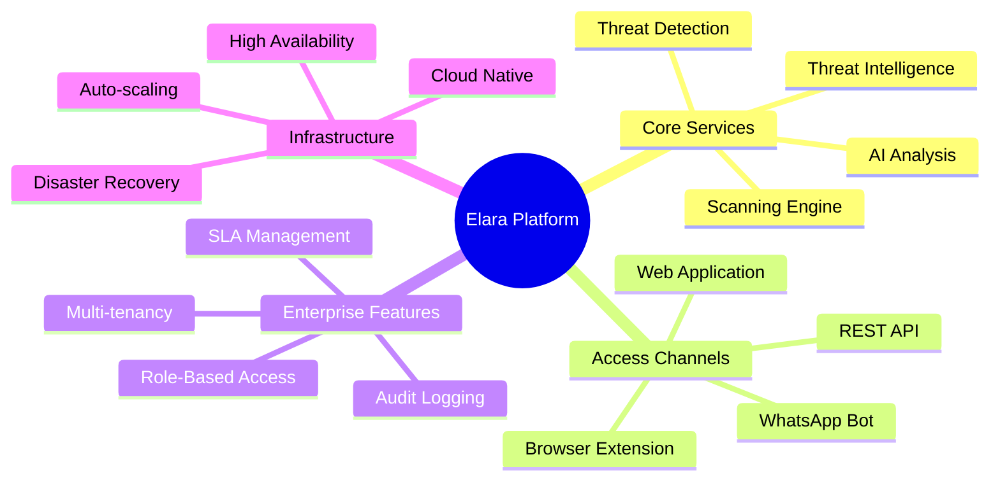

### 1.3 Stakeholders

| Stakeholder | Role | Primary Concerns |
|------------|------|-----------------|
| **End Users** | Individual security users | Ease of use, accuracy, speed |
| **Security Analysts** | Enterprise security teams | Threat intelligence, analysis depth |
| **Administrators** | System administrators | Configuration, monitoring, reporting |
| **Developers** | API consumers | API availability, documentation |
| **DevOps Team** | Infrastructure management | Reliability, scalability, cost |
| **Compliance Officers** | Regulatory compliance | Audit logs, data protection, GDPR |

---

## 2. Architecture Principles

### 2.1 Core Principles

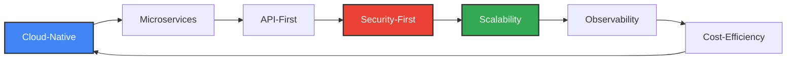

### 2.2 Design Principles

- **Separation of Concerns**: Clear boundaries between components
- **Loose Coupling**: Components communicate via well-defined APIs
- **High Cohesion**: Related functionality grouped together
- **Fail-Fast**: Early error detection and graceful degradation
- **Statelessness**: API services maintain no session state
- **Idempotency**: Safe retry of operations
- **Eventual Consistency**: Asynchronous processing for scalability

### 2.3 Quality Attributes

| Attribute | Target | Strategy |
|-----------|--------|----------|
| **Availability** | 99.9% uptime | Multi-region deployment, health checks, auto-healing |
| **Scalability** | 10K concurrent users | Horizontal scaling, caching, queue-based processing |
| **Performance** | < 2s response time | Redis caching, CDN, database indexing |
| **Security** | Enterprise-grade | JWT auth, RBAC, encryption, audit logging |
| **Maintainability** | < 1 day for fixes | Modular architecture, comprehensive logging |
| **Cost** | < $1000/month | Serverless where possible, auto-scaling, cost monitoring |

---

## 3. High-Level Architecture

### 3.1 System Context Diagram

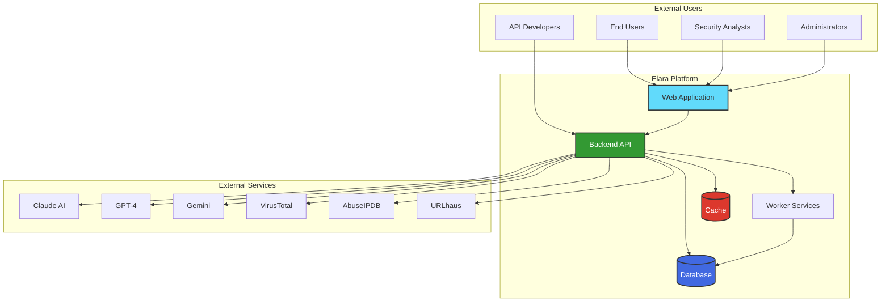

### 3.2 Logical Architecture

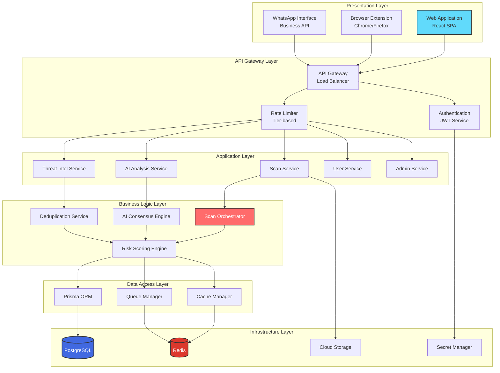

---

## 4. System Components

### 4.1 Component Overview

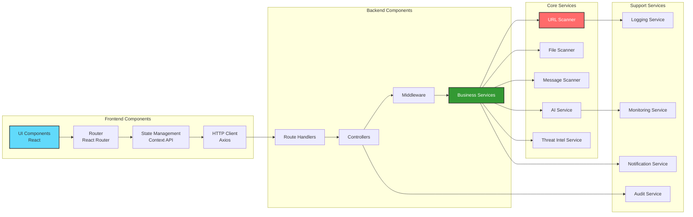

### 4.2 Component Responsibilities

| Component | Responsibility | Technology |
|-----------|---------------|------------|
| **Web Application** | User interface for scanning and results | React 18, TypeScript, Tailwind CSS |
| **Browser Extension** | Real-time URL scanning in browser | Chrome/Firefox Extensions API |
| **WhatsApp Bot** | Messaging interface for scans | WhatsApp Business API |
| **Backend API** | Business logic and data management | Node.js 20, Express.js, TypeScript |
| **Worker Service** | Asynchronous job processing | BullMQ, Node.js |
| **Proxy Service** | Headless browser scanning | Puppeteer, Chrome |
| **Database** | Persistent data storage | PostgreSQL 15, Prisma ORM |
| **Cache** | Session and result caching | Redis 7.0 |
| **Secret Manager** | Credential management | GCP Secret Manager |

---

## 5. Data Flow

### 5.1 URL Scanning Flow

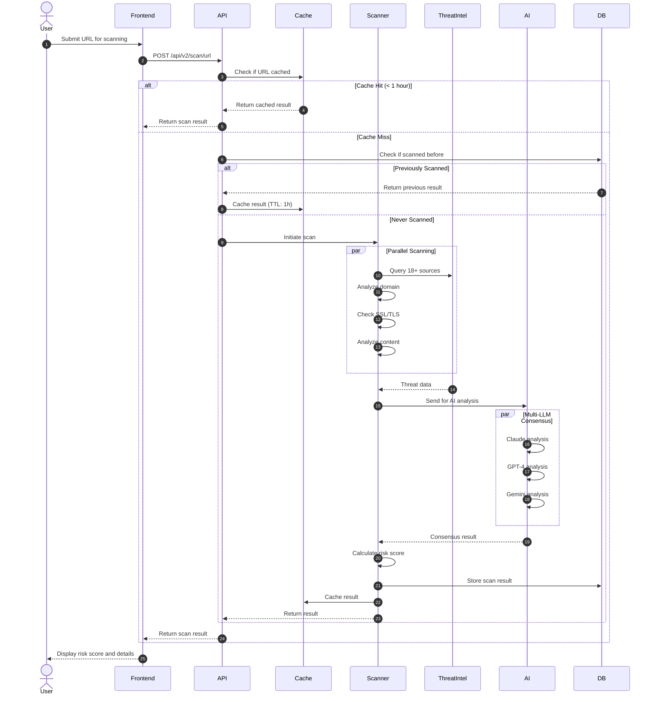

### 5.2 Authentication Flow

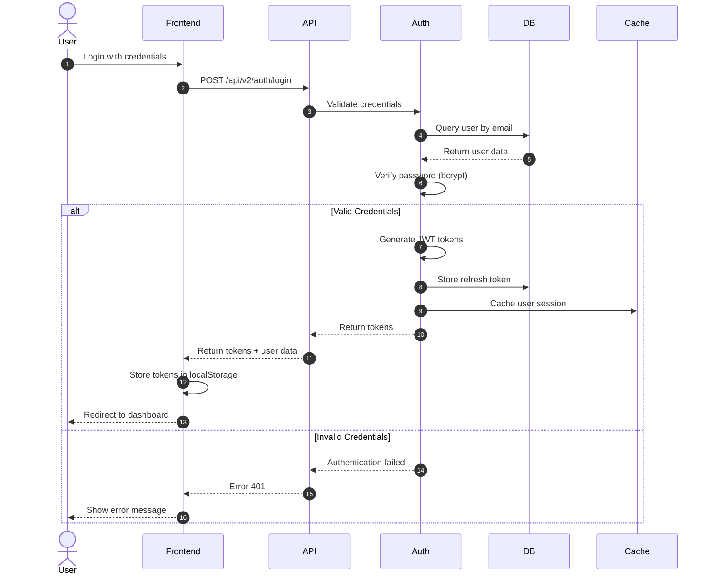

---

## 6. Integration Architecture

### 6.1 External Integrations

```mermaid
graph TB
    subgraph "Elara Platform"
        API[Backend API]
        WORKER[Worker Service]
    end

    subgraph "AI Services"
        ANTHROPIC[Anthropic<br/>Claude Sonnet 4.5]
        OPENAI[OpenAI<br/>GPT-4 Turbo]
        GEMINI[Google AI<br/>Gemini Pro]
    end

    subgraph "Threat Intelligence"
        VT[VirusTotal]
        ABUSE[AbuseIPDB]
        URL_HAUS[URLhaus]
        THREAT_FOX[ThreatFox]
        OTX[AlienVault OTX]
        PHISH_TANK[PhishTank]
        SAFE_BROWSE[Safe Browsing]
        URLSCAN[URLScan.io]
    end

    subgraph "Communication"
        TWILIO[Twilio]
        WHATSAPP_BIZ[WhatsApp Business]
        SENDGRID[SendGrid]
    end

    API --> ANTHROPIC
    API --> OPENAI
    API --> GEMINI

    WORKER --> VT
    WORKER --> ABUSE
    WORKER --> URL_HAUS
    WORKER --> THREAT_FOX
    WORKER --> OTX
    WORKER --> PHISH_TANK
    WORKER --> SAFE_BROWSE
    WORKER --> URLSCAN

    API --> TWILIO
    API --> WHATSAPP_BIZ
    API --> SENDGRID

    style API fill:#339933,stroke:#333,stroke-width:2px,color:#fff
    style ANTHROPIC fill:#FF6B6B,stroke:#333,stroke-width:2px,color:#fff
    style VT fill:#4285F4,stroke:#333,stroke-width:2px,color:#fff
```

### 6.2 Integration Patterns

| Service | Pattern | Protocol | Authentication |
|---------|---------|----------|---------------|
| **Claude AI** | Request/Response | HTTPS/REST | API Key |
| **GPT-4** | Request/Response | HTTPS/REST | API Key |
| **Gemini** | Request/Response | HTTPS/REST | API Key |
| **VirusTotal** | Request/Response | HTTPS/REST | API Key |
| **AbuseIPDB** | Request/Response | HTTPS/REST | API Key |
| **URLhaus** | Data Sync | HTTPS/CSV | Public |
| **ThreatFox** | Data Sync | HTTPS/JSON | Public |
| **WhatsApp** | Webhook | HTTPS/POST | Token |

---

## 7. Deployment Architecture

### 7.1 GCP Deployment

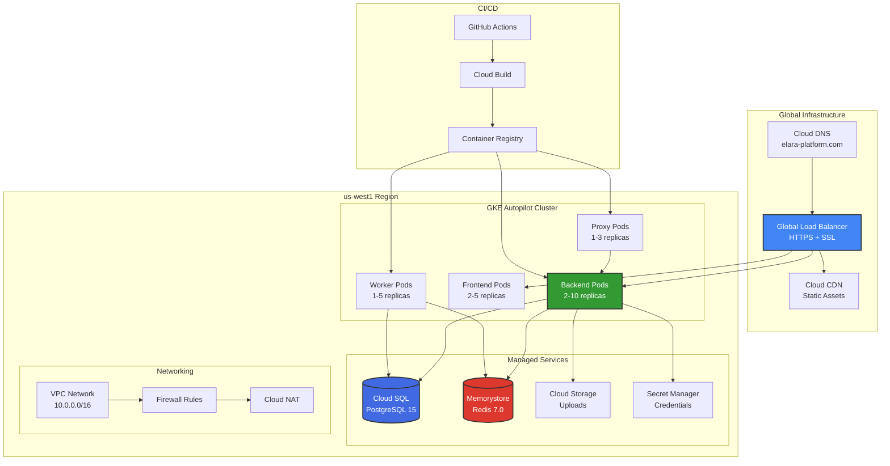

### 7.2 Environment Strategy

| Environment | Purpose | Branch | URL | Auto-Deploy |
|------------|---------|--------|-----|-------------|
| **Development** | Active development | `develop` | http://136.117.33.149 | Yes |
| **Staging** | Pre-production testing | `staging` | _Not deployed_ | Yes (planned) |
| **Production** | Live system | `main` | http://34.36.48.252 | Yes |

---

## 8. Security Architecture

### 8.1 Security Layers

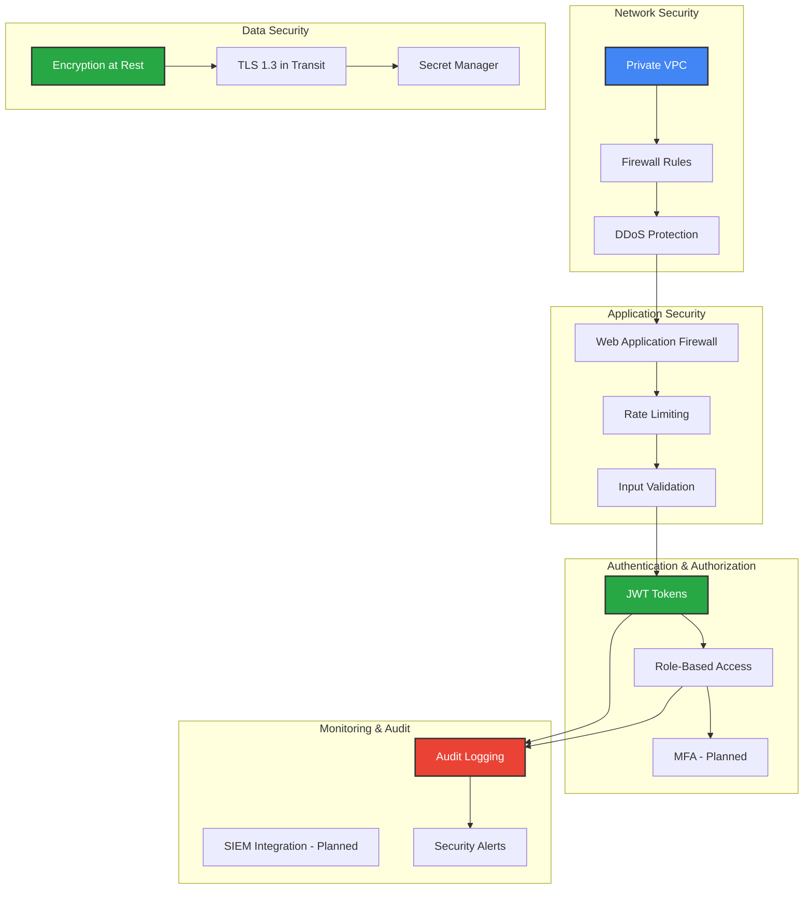

### 8.2 Security Controls

| Control | Implementation | Status |
|---------|---------------|--------|
| **Authentication** | JWT with 30min access + 7day refresh tokens | ✅ Implemented |
| **Authorization** | RBAC with 3 roles (User, Admin, Owner) | ✅ Implemented |
| **Encryption in Transit** | TLS 1.3 for all connections | ✅ Implemented |
| **Encryption at Rest** | AES-256 for database and storage | ✅ Implemented |
| **Secret Management** | GCP Secret Manager with Workload Identity | ✅ Implemented |
| **Input Validation** | Zod schema validation | ✅ Implemented |
| **Rate Limiting** | Tier-based (Free: 100/hr, Pro: 1000/hr, Enterprise: 10K/hr) | ✅ Implemented |
| **Audit Logging** | Complete audit trail in database | ✅ Implemented |
| **MFA** | Two-factor authentication | 🔄 Planned |
| **SIEM Integration** | Security event monitoring | 🔄 Planned |

---

## 9. Scalability & Performance

### 9.1 Scalability Strategy

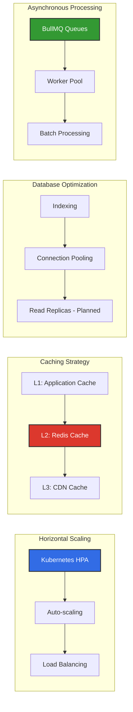

### 9.2 Performance Targets

| Metric | Target | Current | Strategy |
|--------|--------|---------|----------|
| **API Response Time** | < 200ms (p95) | ~150ms | Caching, indexing |
| **Scan Processing Time** | < 30s | ~20-25s | Parallel processing |
| **Concurrent Users** | 10,000 | 1,000 tested | Horizontal scaling |
| **Requests per Second** | 1,000 RPS | 500 tested | Load balancing |
| **Cache Hit Rate** | > 80% | ~75% | Cache optimization |
| **Database Query Time** | < 50ms (p95) | ~30ms | Indexing, pooling |

---

## 10. Technology Decisions

### 10.1 Technology Stack Rationale

| Technology | Reason | Alternatives Considered |
|------------|--------|------------------------|
| **Node.js** | Async I/O, large ecosystem, team expertise | Python (slower for I/O), Go (smaller ecosystem) |
| **TypeScript** | Type safety, better IDE support, maintainability | JavaScript (no type safety) |
| **React** | Component-based, large community, performance | Vue (smaller community), Angular (steeper learning curve) |
| **PostgreSQL** | ACID compliance, JSON support, reliability | MongoDB (eventual consistency), MySQL (less features) |
| **Redis** | High performance, pub/sub, job queues | Memcached (fewer features), RabbitMQ (more complex) |
| **Prisma** | Type-safe ORM, migrations, excellent DX | TypeORM (less type-safe), Sequelize (older) |
| **GKE Autopilot** | Managed Kubernetes, auto-scaling, cost-effective | EKS (AWS lock-in), AKS (less mature) |
| **Terraform** | Infrastructure as Code, multi-cloud, state management | Pulumi (smaller community), CloudFormation (AWS only) |

### 10.2 Key Design Decisions

| Decision | Rationale | Trade-offs |
|----------|-----------|------------|
| **Monorepo** | Shared code, simplified dependencies | Larger repository size |
| **Serverless Functions** _(Avoided)_ | Cost concerns, cold starts | Less operational overhead |
| **Microservices** _(Partial)_ | Scalability, independent deployment | Increased complexity |
| **Multi-LLM Consensus** | Accuracy, redundancy, no vendor lock-in | Higher API costs |
| **Asynchronous Scanning** | Better UX, scalability | Eventual consistency |
| **GCP vs AWS** | Expertise, Autopilot cost savings, better AI integration | AWS has more services |

---

## Revision History

| Version | Date | Author | Changes |
|---------|------|--------|---------|
| 1.0.0 | 2025-10-24 | Elara Team | Initial HLD creation |

---

## Appendices

### A. Glossary

- **HLD**: High-Level Design
- **RBAC**: Role-Based Access Control
- **JWT**: JSON Web Token
- **SLA**: Service Level Agreement
- **HPA**: Horizontal Pod Autoscaler
- **CDN**: Content Delivery Network
- **ORM**: Object-Relational Mapping

### B. References

- [GCP Deployment Blueprint](gcp-deployment-blueprint.md)
- [Prisma ORM Architecture](prisma-orm-architecture.md)
- [Secrets Management Guide](../SECRETS_MANAGEMENT.md)
- [API Documentation](../api/complete-api-reference.md)

---

**Elara Platform - High-Level Design**
Version 1.0.0 | Status: ✅ Production Ready

[⬆ Back to Top](#elara-platform---high-level-design-hld)

