# Elara Platform - Use Case & Data Flow Diagrams

**Version**: 1.0.0
**Last Updated**: 2025-10-24
**Status**: Production Ready

---

## Table of Contents

1. [Use Case Diagrams](#1-use-case-diagrams)
2. [Data Flow Diagrams](#2-data-flow-diagrams)
3. [Sequence Diagrams](#3-sequence-diagrams)
4. [State Diagrams](#4-state-diagrams)
5. [Component Interaction Diagrams](#5-component-interaction-diagrams)

---

## 1. Use Case Diagrams

### 1.1 System-Level Use Cases

```mermaid
graph TB
    subgraph "Actors"
        END_USER[End User]
        SECURITY_ANALYST[Security Analyst]
        ADMIN[Administrator]
        API_DEVELOPER[API Developer]
    end

    subgraph "Elara Platform Use Cases"
        subgraph "Scanning"
            UC1[Scan URL]
            UC2[Scan Message]
            UC3[Scan File]
            UC4[View Scan Results]
            UC5[Export Scan Report]
        end

        subgraph "Analysis"
            UC6[Request AI Analysis]
            UC7[View Threat Intelligence]
            UC8[Check Risk Score]
            UC9[View Historical Trends]
        end

        subgraph "User Management"
            UC10[Register Account]
            UC11[Login]
            UC12[Manage Profile]
            UC13[Upgrade Subscription]
        end

        subgraph "Administration"
            UC14[Manage Users]
            UC15[Configure Threat Sources]
            UC16[View System Metrics]
            UC17[Generate Reports]
            UC18[Manage API Keys]
        end

        subgraph "Integration"
            UC19[Use REST API]
            UC20[Browser Extension]
            UC21[WhatsApp Bot]
        end
    end

    END_USER --> UC1
    END_USER --> UC2
    END_USER --> UC3
    END_USER --> UC4
    END_USER --> UC10
    END_USER --> UC11
    END_USER --> UC12
    END_USER --> UC20
    END_USER --> UC21

    SECURITY_ANALYST --> UC1
    SECURITY_ANALYST --> UC2
    SECURITY_ANALYST --> UC3
    SECURITY_ANALYST --> UC4
    SECURITY_ANALYST --> UC5
    SECURITY_ANALYST --> UC6
    SECURITY_ANALYST --> UC7
    SECURITY_ANALYST --> UC8
    SECURITY_ANALYST --> UC9

    ADMIN --> UC14
    ADMIN --> UC15
    ADMIN --> UC16
    ADMIN --> UC17
    ADMIN --> UC18

    API_DEVELOPER --> UC19

    style END_USER fill:#61DAFB,stroke:#333,stroke-width:2px
    style SECURITY_ANALYST fill:#4285F4,stroke:#333,stroke-width:2px,color:#fff
    style ADMIN fill:#EA4335,stroke:#333,stroke-width:2px,color:#fff
    style API_DEVELOPER fill:#34A853,stroke:#333,stroke-width:2px,color:#fff
```

### 1.2 URL Scanning Use Case (Detailed)

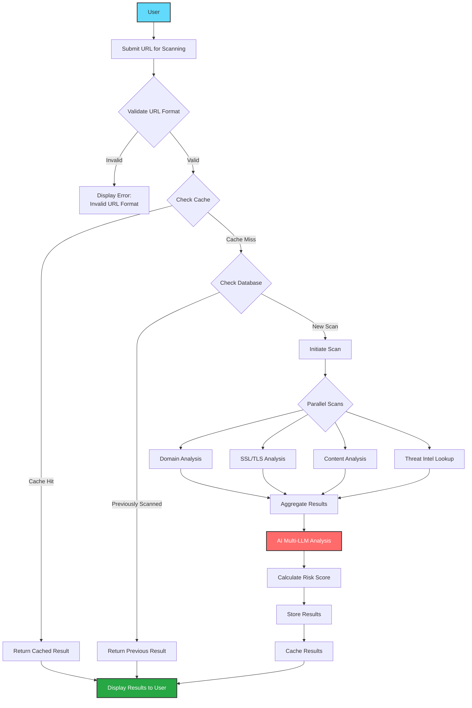

### 1.3 User Authentication Use Case

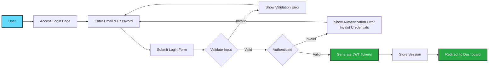

---

## 2. Data Flow Diagrams

### 2.1 Level 0 DFD (Context Diagram)

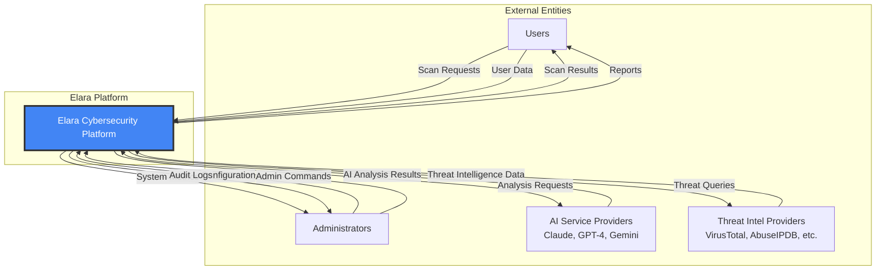

### 2.2 Level 1 DFD (Major Processes)

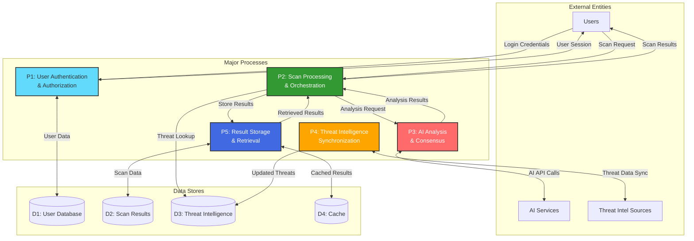

### 2.3 Level 2 DFD (URL Scan Processing)

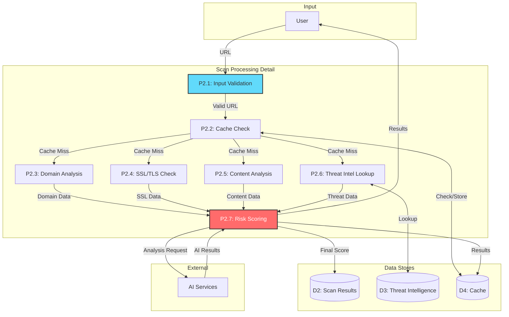

---

## 3. Sequence Diagrams

### 3.1 End-to-End URL Scan Sequence

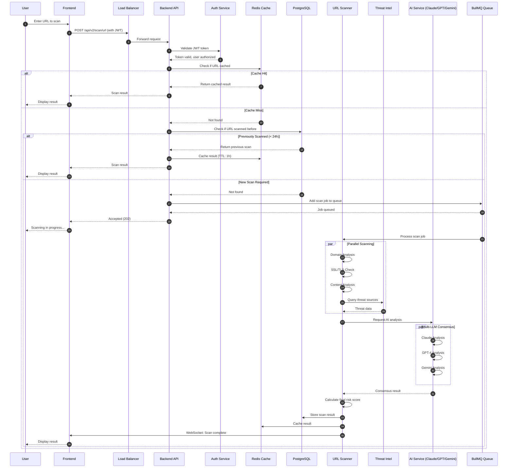

### 3.2 Threat Intelligence Synchronization

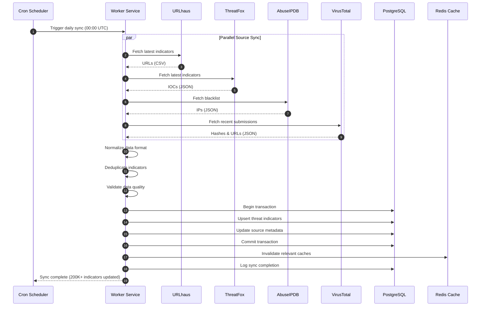

### 3.3 AI Consensus Analysis Flow

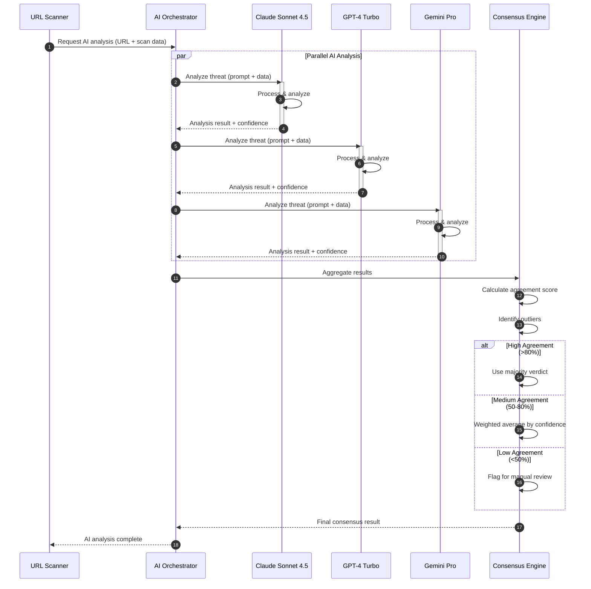

---

## 4. State Diagrams

### 4.1 Scan Result State Machine

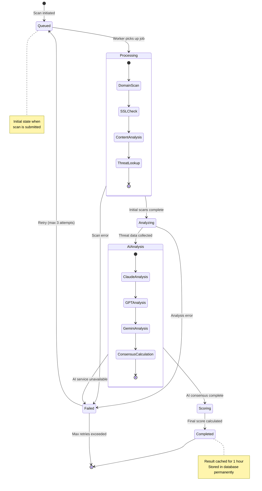

### 4.2 User Session State Machine

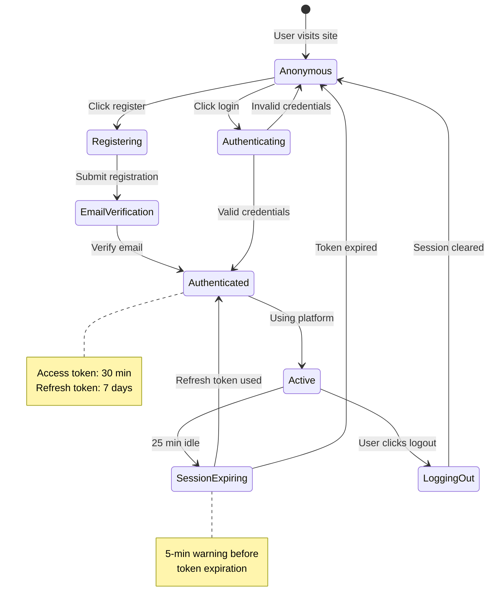

---

## 5. Component Interaction Diagrams

### 5.1 Scanning System Components

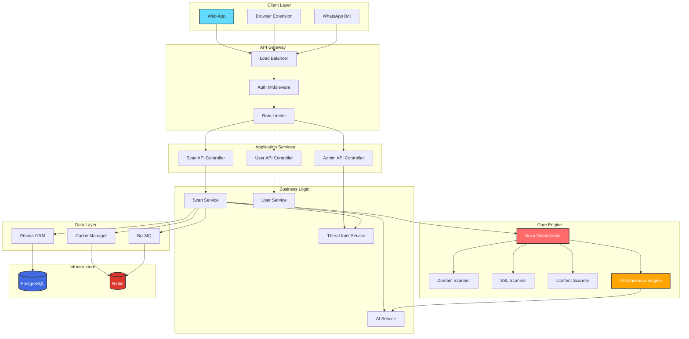

### 5.2 Deployment Component Diagram

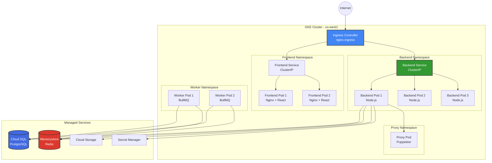

---

## 6. Entity-Relationship Diagram (Conceptual)

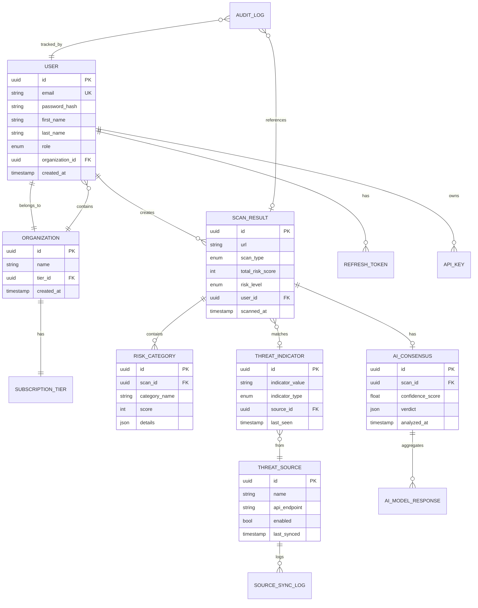

---

## 7. Summary

This document provides comprehensive use case and data flow diagrams for the Elara Platform, covering:

✅ **Use Case Diagrams**: System-level and detailed use cases for all actors
✅ **Data Flow Diagrams**: Level 0, 1, and 2 DFDs showing data flow through the system
✅ **Sequence Diagrams**: End-to-end flows for critical operations
✅ **State Diagrams**: State machines for scan results and user sessions
✅ **Component Diagrams**: System component interactions and deployment architecture
✅ **ERD**: Conceptual entity-relationship model

---

## Additional Diagrams

For additional architecture diagrams, see:

- [High-Level Design (HLD)](high-level-design.md)
- [Low-Level Design (LLD)](low-level-design.md) _(To be created)_
- [Solution Architecture Diagram (SAD)](solution-architecture.md) _(To be created)_
- [GCP Deployment Blueprint](gcp-deployment-blueprint.md)
- [Prisma ORM Architecture](prisma-orm-architecture.md)

---

**Elara Platform - Use Case & Data Flow Diagrams**
Version 1.0.0 | Status: ✅ Production Ready

[⬆ Back to Top](#elara-platform---use-case--data-flow-diagrams)

